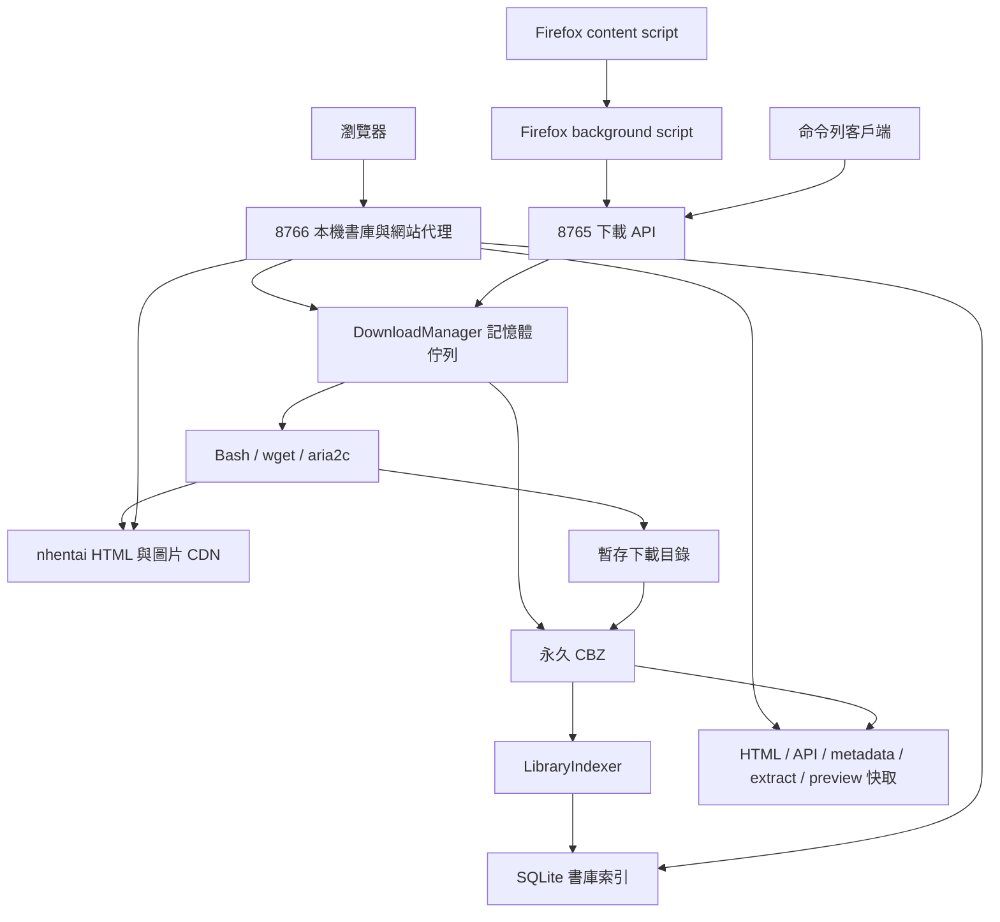

# nh-project 架構與功能說明

本文以原始碼為準，供維護者理解與修改專案。初始盤點基準為 `9039b92`（2026-09-09）；先完成本文件，再進行本次介面修改，正文已同步本次完成後的行為。末節記錄本次實作與驗證狀態。文件不保存實際 cookie 或使用者書籍清單。

## 1. 專案定位與架構

這是以 CBZ 為永久儲存格式的下載服務與本機書庫。服務同時提供匿名上游網站代理、本機搜尋、閱讀器及供 Firefox 外掛使用的下載 API。沒有 Flask、Django、React 或 Node 後端；本機 HTML 直接由 Python 產生。代理頁面的 SvelteKit 程式來自上游，不是本 repo 編譯的前端。



### 核心模組

| 元件 | 職責 |
| --- | --- |
| `server/nh_server.py` | 設定啟動、雙 HTTP server、下載管理、快取、代理、HTML 產生、圖片讀取、維護命令 |
| `server/library_db.py` | SQLite schema、metadata 解析與索引、分類正規化、書庫查詢、背景修補 |
| `server/search.py` | NFKC 正規化、分詞、別名展開、有界拼字距離 |
| `server/config.py` | YAML 結構驗證、設定來源與環境變數映射 |
| `server/static/local-ui.js` / `.css` | 本機與代理頁面的操作、下載控制、分類切換、書單與詳情樣式 |
| `nh2_requireCfToken.sh` | 現行下載器，接受書籍 ID、Cookie、User-Agent、重試／並行參數 |
| `firefox-extension/` | 原站操作按鈕、刪除對話框與下載佇列面板 |
| `tests/` | Python 單元／HTTP 整合測試；`e2e/` 使用 Deno 與 Playwright |

### 執行模型

`main()` 建立兩個 `ThreadingHTTPServer`，共用一個 `DownloadManager` 與 `LocalLibrary`。8765 在主執行緒服務，8766 在背景執行緒服務；各 HTTP 請求由 server 分派執行緒。另有下載 worker、書庫索引器與快取清理器。

書籍下載工作逐本執行，但同一本的圖片由 Bash 啟動多個 aria2c 程序並行下載。Python 的 `RLock` 保護工作狀態；每本書有獨立鎖保護解壓與刪除。SQLite 寫入由資料庫物件內的鎖序列化；每次查詢建立並關閉 connection，啟用 foreign keys、WAL 與 30 秒 busy timeout。

## 2. 功能總覽

### 遠端瀏覽

- 代理首頁、搜尋、七種分類及分類目錄、詳情、隨機、資訊與部分社群公開頁面。
- 上游 canonical redirect 改成本機路徑；內部連結和 GET 表單保持在本機服務，支援 `/nh` 等 URL 前綴。
- 注入本機導覽、下載／刪除控制、Decensored 標示，以及搜尋與分類結果的 Show all / Show downloaded 切換。
- 移除廣告 iframe、已知廣告／追蹤 script、帳號及部分需要登入的操作；不提供收藏、投票、留言寫入或上傳。
- 上游 SvelteKit 可能 hydrate／重新建構 DOM；本機 JS 偵測網址變化並重試安裝控制項。
- 上游靜態資源透過代理取得，卡片圖片通常仍指向 CDN；這不是整個上游網站的離線鏡像。

### 下載與刪除

- 相同 ID 的進行中下載會重用既有工作；CBZ 已存在時直接回傳成功。
- 工作狀態依序為 `queued`、`running`、`succeeded` 或 `failed`；提供建立／開始／完成時間、return code、錯誤與最多 80 行日誌。
- 佇列快照含 running、queued、recent 與計數，recent 最多 30 筆；工作與佇列在記憶體中，服務重啟不會自動恢復未完成的佇列。
- downloader 先存圖片與 `cover_page.html`，Python 以暫存 ZIP 打包，再原子改名成 `{id}.cbz`，成功後才刪除原資料夾。
- 打包完成回呼立即建立索引；metadata 不完整時由背景索引器補齊，不讓 metadata 修補失敗覆蓋成功的下載狀態。
- 刪除需前端確認 ID 與標題。後端拒絕刪除 queued/running 書籍，否則刪除 CBZ、原資料夾、HTML、metadata、extract、preview 與資料庫紀錄。
- 在本機清單刪除後重新載入；詳情頁刪除後留在同一本 `/g/{id}/`，轉為未下載詳情。

### 本機書庫

- `/downloads/` 每頁 50 本，預設下載時間遞減；`sort=id` 使用數值 ID 遞減，`sort=downloaded` 同時間以 ID 遞減。
- 搜尋與分類書單預設 ID 遞減，切換排序回第一頁；分頁保留搜尋與排序，提供頁碼跳轉。
- Random 5 單次抽取最多五本不重複書籍；若結果與上次完全同序，額外重抽一次，因此不保證跨請求永不相同。
- 卡片開啟統一 `/g/{id}/`。本機詳情呈現封面、主／次標題、ID、分類、本機冊數、閱讀入口與頁面縮圖。
- 卡片縮圖優先 CDN，失敗時使用本機 CBZ 第一張頁面；詳情封面使用本機圖片，內頁預覽縮圖透過縮圖端點取得。
- 詳情分類連結可切本機／上游，下載與未下載詳情各自以 `sessionStorage` 記憶，分頁之間不作長期同步。
- 分類結果即使本機沒有該項，也提供空清單與返回上游範圍的選項。
- 標題包含 `decensored`、`uncensored`、`無碼`、`无码`、`無修正`、`モザイクなし` 時，卡片圖片左下角顯示紫色 Decensored；不依 tag 判斷，不套用詳情封面或閱讀圖片。

### 卡片顯示與分類總覽

本機網站的中文旗子一律為 🇹🇼，英文 🇬🇧、日文 🇯🇵。已下載清單、搜尋、分類結果與隨機卡片在產生 HTML 前，以一個 SQL 查詢批次取得該頁所有書籍的 language slug。只映射已知實際語言，多語言去重後依 metadata 順序並列；`translated`、未知語言或缺少 metadata 不產生旗子，也不依標題猜測。

上游的 `lang-cn` 等 class 原本透過 `.caption::before` 的背景 SVG 顯示旗子。本機樣式清除背景圖與固定框，改用旗子字元；JS 也替換 caption 文字中的舊中文旗子。旗子的最終字形由瀏覽器與作業系統 emoji 字型決定。

本機卡片和詳情只保留 Delete 表示已下載，不再顯示綠色 Downloaded 徽章或停用按鈕；`Downloaded ↓` 排序和 Show downloaded 範圍文字仍存在。詳情的 Delete 沿用控制項 ID，避免控制項偵測輪詢誤以為按鈕消失。同一本在不同區塊重複出現時，每張卡片都有自己的控制項，狀態請求仍依 ID 去重。

所有一般 gallery 卡片採每列獨立的 CSS Grid 排版：桌面最多五欄，1100px 以下四欄、850px 以下三欄、600px 以下兩欄、340px 以下一欄。圖片區域為 5:7 並以 contain 保持比例；標題處於正常文件流程、完整換行，卡片與標題底色填滿該列最大高度。標題不再依賴 hover。MutationObserver 處理延遲 hydration、卡片插入與文字變更，透過 requestAnimationFrame 合併重排準備，不改寫上游整個 DOM。

七種本機分類總覽為 `/downloads/tags/`、`artists/`、`characters/`、`parodies/`、`groups/`、`languages/`、`categories/`。目錄使用分類名稱與冊數 pill 網格，僅列出目前 SQLite 有書籍關聯的分類。每項計算不同 gallery ID 的數量，包含 pending 書籍已有的分類，不包含暫存預覽。

目錄接受 `q`、`sort=count|name`、`page`，每頁 100 項；預設冊數遞減，同數量以正規化名稱和 slug 排序。名稱升冪亦以 slug 打破平手。搜尋對名稱／slug 使用與書庫一致的 NFKC、casefold、空白與連字號正規化，再作子字串匹配，不使用模糊拼字或別名展開。空結果維持第 1/1 頁，超界頁碼收斂到有效頁。

搜尋或更換排序從第一頁開始，分頁保留條件；點分類進入既有單數 `/downloads/{type}/{slug}/` 書單。書庫及已下載詳情的七個分類導覽指向本機目錄，手機也可存取。目錄的 Show all / Show downloaded 切換對應的上游／本機目錄，並重設目錄查詢條件。所有頁面由 server 產生，不新增公開 JSON API，也沒有新增資料表或 migration。

### 搜尋語意

搜尋涵蓋英文、日文、pretty 標題及七種分類的名稱和 slug。NFKC、casefold、連字號及空白正規化後，關鍵字之間使用 OR；雙引號保留片語。搜尋可以跨不同 metadata 欄位命中。

Latin 字詞 4–7 字母允許一次編輯，8 字母以上允許兩次；距離包含相鄰交換。短字詞及中日文以子字串與明確別名匹配。結果依書單排序，不依相似度分數排序。

別名預設空白，從 `<storage>/.nh-local/search-aliases.yaml` 讀取，或以 `NH_SEARCH_ALIASES_FILE` 指定。格式為 `aliases: [[name1, name2], ...]`；重疊群組遞迴展開。修改後重啟服務生效，不自動猜測翻譯。

### 閱讀

已下載書籍從 CBZ 抽取圖片，未下載書籍則取得一次 gallery metadata，經 `/preview-media/` 暫存原圖；兩者都由本機 reader 產生 HTML，不逐頁取得上游 reader HTML。

頁碼來自數字檔名，支援 JPG、JPEG、PNG、GIF、WebP；圖片索引持久化為 `.images.json`，避免每次掃描解壓目錄。預載下一張圖片。圖片以實際顯示寬度的中線分成左右半邊，左側上一頁、右側下一頁，中線歸右側；使用 `clientX` 與 `getBoundingClientRect()` 比較，因此原尺寸水平捲動後仍依圖片本身判斷。第 1 頁的 Prev、圖片左側及左方向鍵返回詳情；末頁的 Next、圖片右側及右方向鍵也返回詳情。舊 `/downloads/g/` 網址使用 302 轉到 `/g/` 並保留 query。

暫存預覽不建立 CBZ、不加入已下載書庫。無圖片時顯示 unavailable 訊息；上游 metadata 失敗有獨立錯誤頁。

新版共用 reader 是深色單一工具列，順序為 Gallery、Prev、目前／總頁數、數字跳頁框與 Go、Next、尺寸 select；暫存預覽額外標示 Temporary preview。跳頁支援 Enter 或 Go，限制 1 至總頁數的整數，空白、小數與超界值由表單驗證擋下；無頁數時停用。跳頁由已含部署前綴的表單 action 組成 `/g/{id}/{page}/`。body 採 `100dvh`、上下兩列 Grid，工具列占自然高度，剩餘高度為可捲動圖片區。

`fit` 為預設，依圖片 naturalWidth/naturalHeight 及閱讀區可用寬高扣除 32px 留白，取 `min(1, widthScale, heightScale)`；不裁切、不放大小圖。`original` 使用自然像素對應 CSS 尺寸，允許水平與垂直捲動。圖片 load 與閱讀區 ResizeObserver 重新計算，能處理手機旋轉及工具列換行。

偏好保存在 `localStorage["nh-reader-mode:" + (BASE_PATH || "/")]`，有效值為 `fit` / `original`；同 origin、同部署前綴跨書籍與重新開啟瀏覽器沿用，storage event 同步其他開啟分頁。未知值或儲存不可用時回到 fit，當頁仍可切換。左右鍵保持翻頁，但表單、按鈕、可編輯元素或搭配修飾鍵時不攔截；瀏覽器自己的縮放仍有效。

## 3. HTTP 介面

### 頁面與資源（預設 8766）

下表路徑均可加上設定的 `base_path`；例如 `/nh/downloads/`。

| 路徑 | 用途 |
| --- | --- |
| `/`、`/search/`、`/{type}/{slug}/` | 上游匿名瀏覽代理 |
| `/tags/` 等複數目錄 | 上游分類目錄 |
| `/downloads/` | 已下載清單；`page`、`sort` |
| `/downloads/search/` | 本機搜尋；`q`、`page`、`sort` |
| `/downloads/random/` | 隨機五本；no-store |
| `/downloads/{type}/{slug}/` | 單項本機分類書單；`page`、`sort` |
| `/downloads/{directory}/` | 七種複數分類總覽；`q`、`sort=count|name`、`page`，每頁 100 項 |
| `/g/{id}/` | 存在 CBZ 時本機詳情，否則上游詳情代理 |
| `/g/{id}/{page}/` | 共用本機 reader |
| `/downloads/g/{id}/[page/]` | 舊連結重新導向 |
| `/media/{id}/{filename}` | 抽取的本機圖片 |
| `/catalog-thumbnail/{id}` | 本機書單封面備援 |
| `/preview-media/{id}/{page}` | 暫存原圖 |
| `/preview-thumbnail/{id}/{page}` | 內頁縮圖 |
| `/_nh-local/assets/local.js`、`local.css` | 本機共用前端 |
| `/api/v2/...` | 白名單公開 GET API 代理 |

七種 `type` 為 `tag`、`artist`、`character`、`parody`、`group`、`language`、`category`。API v2 白名單包含 config、cdn、gallery 查詢／相關內容、search、tags、taxonomy 與部分公開使用者資訊；zones 回傳空物件以避免載入廣告區域。

### 下載 API

8765 前綴為 `/api`；8766 同源前綴為 `/_nh-local/api`。以下除 health 與分類計數外，兩者提供相同功能。

| 方法／相對路徑 | 輸入與回應 |
| --- | --- |
| `GET /health`（僅 8765，無 API 前綴） | `{"ok":true}` |
| `POST /download` | `{"id":"123456"}`；回 Job，新建 202、重用 200 |
| `GET /jobs/{job_id}` | Job；找不到 404 |
| `GET /queue` | running、queued、recent 陣列與 counts |
| `GET /galleries/{id}` | id、downloaded、job_id、status、error |
| `POST /galleries/status` | `{"ids":["123456"]}`；`{"galleries":{"123456":{...}}}` |
| `DELETE /galleries/{id}` | id、deleted、blocked、deleted_paths；有進行中工作回 409 |
| `POST /taxonomies/counts`（僅 8766） | `{"taxonomies":[{"type":"artist","slug":"name"}]}`；`{"counts":{"artist/name":3}}` |

ID 必須為數字字串，batch 最多 100 項，JSON body 上限 64 KiB。無效輸入 400、不允許的網段 403、未知端點 404；上游取得失敗通常回 502。API 以 CBZ 存在判定 downloaded，不能以 recent job 是否成功取代。

## 4. SQLite 與索引

資料庫位於 `<storage>/.nh-local/library.sqlite3`。

| 表格 | 主要內容與約束 |
| --- | --- |
| `galleries` | 數值 ID 主鍵、media ID、三種標題、封面路徑、downloaded_at、archive mtime/size、metadata complete/pending、source、indexed_at |
| `taxonomies` | `(id,type)` 複合主鍵，`(type,slug)` 唯一，名稱、上游 URL、上游冊數與觀察時間 |
| `gallery_taxonomies` | gallery 與 taxonomy 關聯，複合主鍵去重，保留來源 ID 與原始順序，外鍵連動刪除 |
| `taxonomy_aliases` | 同 type 的上游 ID 對 canonical ID 映射 |
| `gallery_titles_fts` | FTS5 trigram 標題表與維護 triggers；現行綜合搜尋主要使用下列 document/term 表 |
| `gallery_search` | 每本正規化的標題＋分類搜尋文件 |
| `gallery_search_terms` | `(term,gallery_id)` 索引，供拼字候選展開 |

初始化包含舊版本增欄與搜尋文件補建，不需另外執行 migration。分類以 slug 合併不同上游 ID；重新索引會更新關聯、移除孤立分類並刷新受分類名稱變更影響的搜尋文件。upsert 保留既有 `downloaded_at`，初次索引使用 CBZ mtime。

metadata 優先從 CBZ 的 `cover_page.html` 解析：支援舊 `window._gallery = JSON.parse(...)` 與 SvelteKit `data-sveltekit-fetched` gallery API envelope；失敗則用 meta title/image 建 pending 記錄。背景索引器依 mtime_ns 和 size 判斷變化、清理遺失 CBZ 的紀錄，每輪以至少一秒間隔逐本修補 pending metadata，平時約五分鐘再次掃描，下載完成可喚醒。

## 5. 儲存與快取

```text
<storage>/
  {id}.cbz                  永久書籍
  {id}/                     尚未打包的下載內容
  .nh-local/
    library.sqlite3         可重建的書庫 metadata 索引
    search-aliases.yaml     使用者別名
    html/{id}/              詳情 HTML
    metadata/{id}.json      從詳情解析的 metadata
    proxy/                  URL SHA-256 命名的 HTML 與 API 快取
    extract/{id}/           CBZ 圖片、.complete、.images.json
    preview/{id}/           暫存 metadata／圖片／縮圖
    restore-report.json     還原進度與失敗報告
```

| 設定 | 預設 |
| --- | --- |
| HTML freshness | 900 秒 |
| API freshness | 60 秒 |
| HTML/metadata/proxy 最久未使用時間 | 7 天 |
| HTML/metadata/proxy 合計容量 | 512 MiB |
| 抽取圖片容量 | 5 GiB |
| preview 最久未使用時間 | 24 小時 |
| preview 合計容量 | 2 GiB |
| 背景清理間隔 | 3600 秒 |

HTML 在上游取得失敗時可使用 stale 快取並顯示提示；API 在網路失敗或上游 5xx 時使用既有快取。random 不使用一般 HTML 快取。快取以暫存檔加原子 rename 寫入；清理依最後使用時間，保護目前抽取中的書籍，永不因快取容量移除 CBZ。

解壓只取允許副檔名，檢查路徑不逃出目錄，限制展開總量為 `max(CBZ size × 20, 1 GiB)`；先寫暫存目錄與完成標記再換入。CDN 請求輪替設定的媒體伺服器，驗證最終 host、image content type，單原圖上限 100 MiB、縮圖 20 MiB。

## 6. 設定、部署與維護

Python runtime 使用標準庫 HTTP、urllib、sqlite3、zipfile、threading 等模組；YAML 需要 `PyYAML>=6.0,<7`。SQLite 需支援 FTS5/trigram。現行下載器使用 Bash、wget、aria2c、procps 與標準文字處理工具。

YAML 分為 `auth`、`server`、`paths`、`download`、`cache`，拒絕未知區塊／key。設定檔依 `--config`、`NH_CONFIG_FILE`、repo 根目錄 `config.yaml` 選擇；一般設定優先序為 CLI > 既有環境變數 > YAML > 預設值。YAML paths 相對設定檔目錄解析，支援 `~`。auth 缺少時相容 legacy `cookie.sh`；明確 `--cookie-file` 走既有 shell 載入流程。

預設 API／library 埠為 8765／8766；程式預設 allowed networks 包含 localhost、192.168.50.0/24、172.17.0.0/16、100.64.0.0/10，實際可被 YAML／環境／CLI 覆寫。只有 trusted proxy socket peer 可提供 `X-Forwarded-For`，由右往左剝除可信 hop 後驗證來源。8765 拒絕一般瀏覽器 Origin，允許無 Origin 客戶端與 `moz-extension://`；8766 前端使用同源 API。

`server.Dockerfile` 使用 Alpine 3.23 與 Python，安裝下載依賴，只複製 server 與現行下載器。Compose 掛入唯讀設定及 storage，指定 UID/GID、重啟策略與 healthcheck。原始 `Dockerfile` 是另一路下載器 image，不等同 server image。systemd 範例有固定帳號與工作路徑，部署時需配合環境。

`deploy/` 提供 nginx 與 Copyparty 範例；它被 gitignore 排除，是本機部署參考，不是已追蹤的 server 原始碼。nginx `/nh/` 保留前綴轉發，server 必須設定對應 base path。實際 compose 掛載應以現場檔案為準，不把 README 的示例視為現行部署事實。

```bash
python3 server/nh_server.py --config config.yaml
python3 server/nh_server.py --config config.yaml --reindex-library
python3 server/nh_server.py --config config.yaml --refresh-gallery 123456
python3 server/nh_server.py --config config.yaml --restore-library-db /path/library.sqlite3
```

還原逐本處理 source DB 的 ID，略過已有 CBZ，保留來源 downloaded_at；新 metadata 不完整時沿用來源 metadata，失敗記入 JSON 後繼續。可中斷重跑，支援 `--restore-report`。維護操作不應與正式 server 同時修改同一書庫。

### Firefox 與歷史工具

Firefox Manifest v2 content script 安裝在原站，background script 依序嘗試設定的三個 LAN/Tailscale API 位址。外掛提供下載／刪除與每秒更新的 queue panel，獨立於本機網站前端，本次不修改其顯示規則。

`download.sh` 從文字檔逐行送 ID 給現行下載器；`folder2cbz.sh` 使用 zip 移動檔案打包。`nh2.sh`、`nh2_old.sh` 為歷史實作，不能視為現行 server 路徑；`test.sh` 是會移動／刪除下載檔案的歷史 benchmark，不是安全的回歸測試入口。

### 已知限制

- 正式 queue 不持久化；CBZ 存在是 downloaded 的判準，沒有完整逐頁校驗的資料庫狀態。
- Bash 子工作主要以程序存活追蹤；Python 依主程序 exit code 判斷，不能據此保證每張圖均完整下載。
- 上游 HTML、API、CDN 及 Cloudflare 行為可能改變；cookie 有效性與原站可用性不是本機測試能保證的。
- metadata 索引採最終一致：新檔案或外部移除可能需等背景掃描；pending 記錄缺少分類資訊。
- 本機卡片有封面備援，但 CDN 詳情縮圖與上游靜態資源仍可能需要網路。

## 7. 測試與本次變更紀錄

```bash
python3 -m unittest discover -s tests -q
deno run -A npm:playwright@1.62.1 install chromium
deno task e2e
# 選用，需正常運行的服務與上游連線：
NH_RUN_LIVE_E2E=1 deno task e2e:live
```

Python 測試使用暫存資料夾與合成 archive，涵蓋配置、下載、HTTP、cache、索引、搜尋與還原。確定性 E2E 使用 Playwright Chromium、合成圖與 stub 上游，涵蓋 hydration、前綴路由、下載控制、分類與 reader。live smoke 是另行啟用的外部整合檢查。

初始基準：69 個 Python 測試通過；規劃階段缺少匹配的 Chromium，且未帶既有連線設定的 `/tags/` 請求回覆 403。實作時安裝 Playwright Chromium，並用專案既有連線設定成功核對上游 `/tags/` 的 pill 分類目錄及旗子背景 SVG 規則。

### 2026-09-09 變更

1. 本機網站中文旗子改為 🇹🇼；所有本機書單加入語言前綴。
2. 共用 reader 改深色單一工具列，增加 fit/original、長期記憶及跨分頁同步。
3. 移除本機綠色 Downloaded，保留 Delete；移除 server 中已無引用的舊內嵌 UI 常數。
4. 增加七種分類總覽、搜尋、排序、100 項分頁及隨範圍切換的導覽。
5. 書單完整標題採每列等高，兼容重複書籍、延遲 DOM 重建與行動裝置。
6. 新增 Python 分類／語言／HTTP 測試和瀏覽器版面／reader 測試，修正既有純 HTML 測試誤啟動背景索引器而造成暫存目錄清理競態。
7. 後續調整：卡片標題移除新增的字體覆寫，恢復上游／本機原先各自的字體，保留完整等高排版；reader 增加圖片左右半邊翻頁、首頁返回詳情及頁數右側的數字跳頁框。

Firefox 外掛、現場 compose 修改與正式服務保持原狀；沒有修改 CBZ 或正式資料庫，也尚未部署／重啟正式服務。介面語言沿用專案現有英文，本文使用繁體中文。

最終驗證（2026-09-09）：`python3 -m unittest discover -s tests -q` 共 **73 個測試通過**；`deno task e2e` 共 **3 組瀏覽器整合測試通過**；`git diff --check` 通過。已檢視桌面與手機截圖，確認中文旗子、完整標題、分類導覽及 reader 工具列。正式部署的 live smoke 未執行。

可設定 `NH_E2E_ARTIFACT_DIR` 讓 presentation E2E 輸出桌面／手機書單、分類總覽與 reader 截圖；圖像內容皆為合成測試圖片。測試環境缺少中日文／emoji 字型時，DOM 與幾何測試仍可執行，但視覺檢查需提供相應字型。本次僅在 `/tmp/nh-project-review/` 放置測試字型與 fontconfig，沒有變更專案的字型依賴或系統字型設定。
